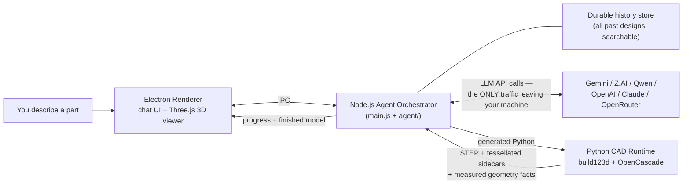
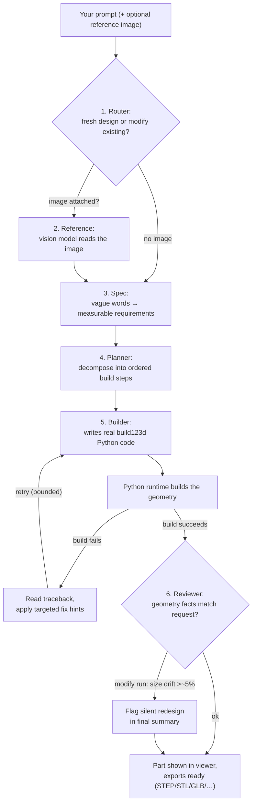
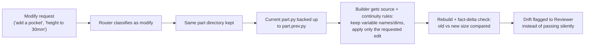

# Cadara — How It Works

Flowcharts describing exactly what the code does (`main.js`, `agent/*`,
`cad-runtime/`, `renderer/`). View this file on GitHub (or any Mermaid-enabled
viewer) to render the diagrams.

## 1. Big picture

## 2. Six-stage agent pipeline (one request)

## 3. Modify continuity (follow-up edits)

## Notes

- **Self-healing loop**: the builder retries failed builds by reading each
  traceback and applying fix hints — bounded iterations (default 8, capped at
  4 in fast mode, raised to at least 12 in thorough mode).
- **Rate limits** retry the same conversation turn without burning a build
  iteration; every pipeline stage reports progress events to the UI.
- **Fallbacks everywhere**: unparseable spec/planner output falls back to
  deterministic defaults so a run never dead-ends mid-pipeline.
- **Cancellation**: long stages honor `AbortSignal`, so stopping a run kills
  in-flight LLM calls and the Python subprocess.
- **Texture pass**: after geometry, an optional stage turns a finish
  description ("brushed aluminium") into a material spec for the viewer.
