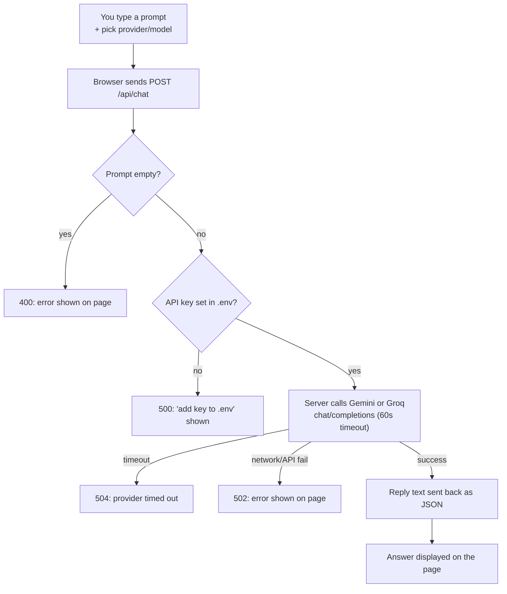
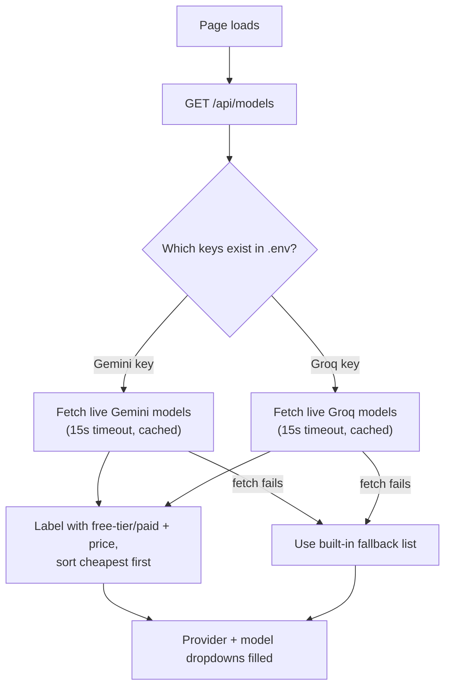

# zen-chat — How It Works

Flowcharts describing exactly what the code does (`server.js` + `public/app.js`).

## 1. Main chat flow

## 2. Model catalog (on page load)

## Notes

- API keys never leave the server: the browser only talks to `/api/models` and
  `/api/chat`; the backend attaches keys when forwarding requests.
- The model cache lives in memory per provider + key, so provider catalogs are
  fetched once per server session.
- Errors are always returned as `{ "error": "message" }` with an appropriate
  HTTP status code.
